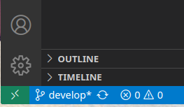
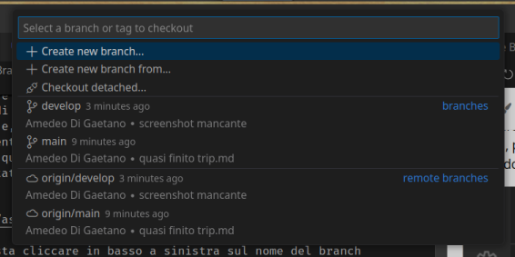
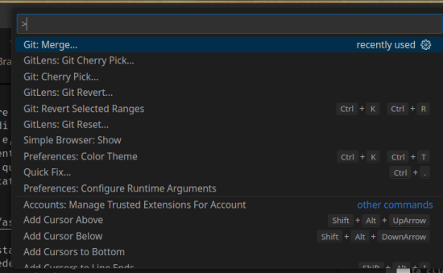
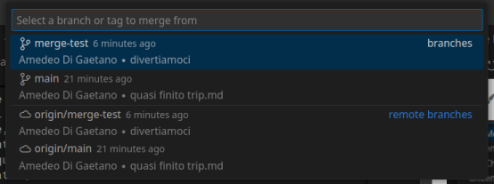
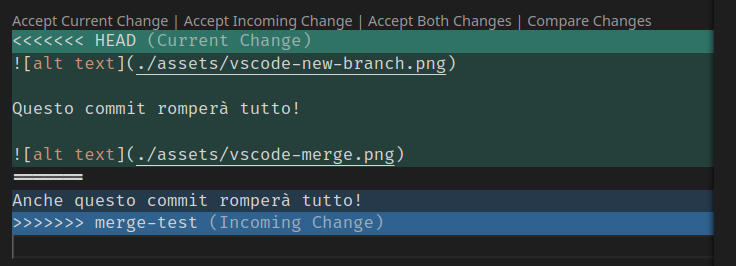
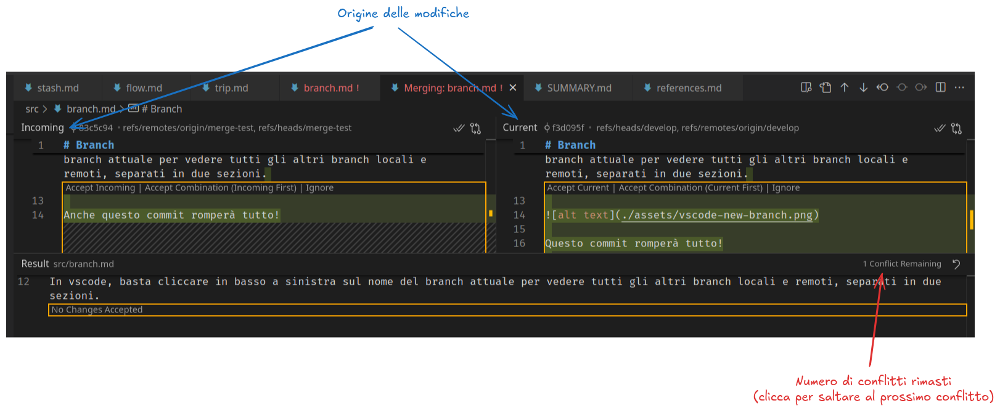
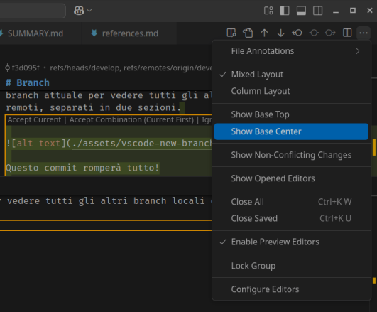
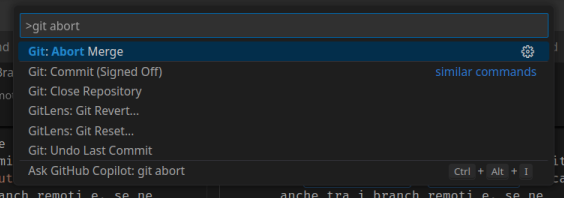

# Chi fa da sè, non fa merge

Non usare `git checkout` come i tuoi antenati per cambiare branch! La soluzione moderna è:
```bash
git switch
```

Oltre ad essere meno confusionario rispetto alle mille e uno funzionalità di `git checkout`, `git switch` cerca anche tra i branch remoti e, se ne trova uno con lo stesso nome, automaticatimente cambierà il riferimento HEAD con lo stato più aggiornato di quel branch, portando con sé tutte le modifiche non ancora committate (evitando di dover fare stash -> checkout -> pop).



In vscode, basta cliccare in basso a sinistra sul nome del branch attuale per vedere tutti gli altri branch locali e remoti, separati in due sezioni.



Per effettuare un merge, basta aprire il pannello dei comandi (Ctrl + Shift + P) e cercare merge...





Una volta selezionato il branch verrà automaticamente creato il commit di merge. Se invece dovessero esserci dei conflitti, dal menu git vedrete i file in questione con dei punti esclamativi. Aprendone uno potrete risolvere tutti i problemi in due maniere: quella scomoda...



...e quella furba (cliccando su "Resolve in Merge Editor")



Inoltre, è possibile abilitare un'ulteriore riquadro per visualizzare lo stato del file prime di entrambe le modifiche



Infine, per annullare un commit (o semplicemente riprovare)

si può usare

```bash
git merge --abort
```



Piccola chicca: se per caso vuoi ripetere la risoluzione dei conflitti su un singolo file:

```bash
git checkout -m file
```