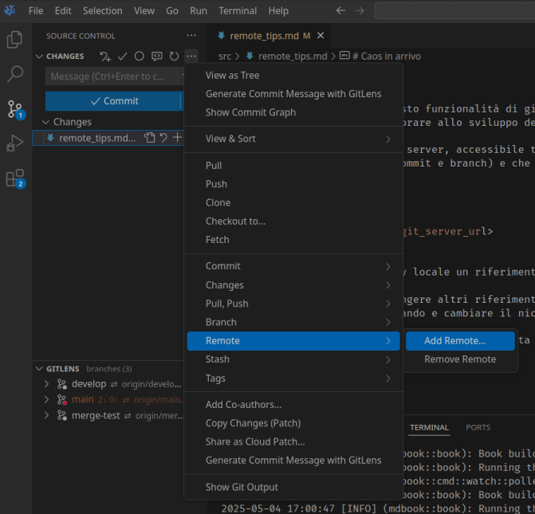
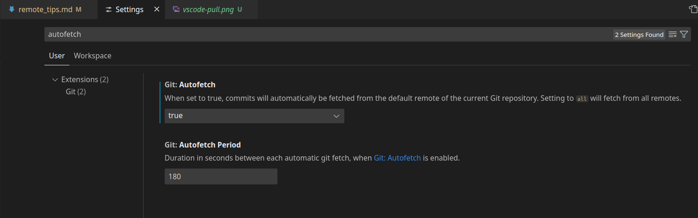

# Caos in arrivo

Fino ad ora, abbiamo visto funzionalità di git interamente locali. Tuttavia, per sfruttare al meglio il suo potenziale
e permetterci di collaborare allo sviluppo del codice bisogna complicare il discorso introducendo un `remote`.

Con `remote` intendo un server, accessibile tramite ssh o http, che viene utilizzato per mantenere tutte le modifiche che vengono effettuate al codice (commit e branch) e che sia comune a tutti gli sviluppatori.

Con

```bash
git remote add origin <git_server_url>
```



si associa al repository locale un riferimento remoto, dandogli il nome di `origin` (nome default per remote di default).

<div class="warning">
Attenzione! L'aver aggiunto un remote non significa che in automatico i branch locali siano associati ai corrispondenti omonimi
lì presenti. Accertarsi di cambiare il branch attivo con git switch che in automatico _dovrebbe_ effettuare l'associazione 
</div>

Nulla ci vieta di aggiungere altri riferimenti, per esempio se vogliamo tenere un'altra copia del progetto su un altro server.
Basta rieseguire il comando e cambiare il nickname associato da origin ad uno a piacere.

Per elencare tutti i remote associati, basta eseguire

```bash
git remote -v
```

(Il comando mostrerà il link duplicato, uno per le operazioni di fetch e uno per le operazioni di push. Nella maggior parte dei casi, questi coincideranno).

Per tenere i repository locale e remoto aggiornati, si usano i comandi `git fetch` e `git push`.

Con il primo, si recuperano tutte i commit nuovi non ancora presenti nel repository locale da tutti i branch, ma non si effettua alcuna operazione modifica del workspace, in quanto potrebbe portare a perdita di lavoro non committato.

<div class="warning">
Diversamente da quanto si dice, git fa di tutto per non far perdere a nessuno le modifiche effettuate
</div>

Una volta recuperate gli aggiornamenti dai remote, bisogna effettuare un merge tra le modifiche locali **(che vanno committate!)** e quelle remote.

Tuttavia, visto che si tratta di un'operazione molto frequente esiste il comando ben più noto

```bash
git pull
```

che è una semplice combinazione di `git fetch` e `git merge`.


Consiglio vivamente di abilitare la funzione di autofetch di vscode, abilitabile dalle impostazioni, per essere sempre aggiornati
con il repo remoto.



Se non ci accorgessimo di modifiche remote sul branch in cui lavoriamo e effettuassimo un commit in locale,
git lancererebbe un errore menzionando che i commit più recenti sul branch sono diversi tra i due repo.
Perciò suggerisce di effettuare un pull, che crea un commit di merge, per poi ritentare il push.

Tuttavia, il commit di merge così creato può risultare confusionario, in quanto non si tratta di un vero merge
tra due branch separati ma solo un errore di svista. Per questo è possibile abilitare con la seguente configurazione

```bash
git config --global pull.rebase true
```

un comportamento diverso del pull: viene effettuato un rebase che "sposta" i commit _locali_ come se fossero stati effettuati dopo quelli provenienti dal remote. In questo modo, verrà rispettato l'ordinamento atteso dei commit, senza inframezzamenti
strani dovuti al lavoro simultaneo sullo stesso branch.

L'operazione di pull potrebbe fallire se nel repository remoto sono state effettuate modifiche su file tracciati da git
che abbiamo modificato localmente ma non ancora committato. In questo caso, si può velocemente creare uno stash,
effettuare il pull e reintegrare l'ultimo stash creato.
