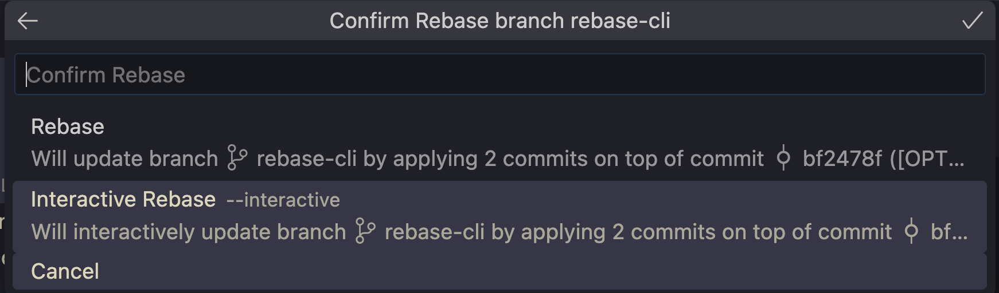

# Mamma, ho pushato le credenziali di produzione

Supponiamo che, per sbaglio, tu abbia committato e pushato su repository remoto delle credenziali che sarebbero dovute rimanere segrete. Che fare?

Qualsiasi push successivo riuscirebbe a rimuoverle, ma rimarrebbero comunque visibili da tutti nella storia dei commit.
Ma niente paura! Per questo esiste

```bash
git rebase -i
```



Apparirà una finestra in cui sarà possibile:

- riordinare i commit
- modificare il messaggio di commit di commit passati
- effettuare lo squash, cioè la combinazione delle modifiche di più commit in uno solo


Ed è grazie a questa ultima opzione che si può far sparire una modifica errata.

Se da la riga di un file, contenente delle credenziali, presenta dei commit nel seguente ordine

1. `password=DUMMY_PASSWORD`
2. `password=SUPER_SECRET_PASSWORD`
3. `password=DUMMY_PASSWORD`

effettuando lo squash dei commit 2 e 3, rimarrà solamente il risultato finale, cioè `DUMMY_PASSWORD`!

Ovviamente, tutto ciò è possibile solamente avendo alcune accortezze. Dopotutto, si tratta di cambiare la linea temporale e,
come sappiamo bene, è facilissimo fare un film dalla trama orrenda se si mettono in mezzo i viaggi nel tempo.

Se si tratta di un branch in cui si sta lavorando da soli, basta un push per risolvere tutto.

Se invece anche altri colleghi stanno lavorando su quel branch, l'operazione potrebbe richiedere un force push.
In questo caso, provare prima con

```bash
git push --force-with-lease
```

Se anche questo dovesse lanciare un errore, avvisare i colleghi di effettuare un backup dei commit effettuati (magari tramite patch), salvare in stash eventuali modifiche ed effettuare il ***pericolossissimo*** comando

```bash
git push --force
```

e sovrascrivere il branch remoto con quello locale.

Uno dei colleghi potrà poi effettuare il rebase della storia locale (che conterrà ancora i commit cancellati in remoto)
per non perdere nulla e pushare con i commit nuovamente integrati.

Se, per qualsiasi motivo, non sono stati effettuati backup dei commit oppure nel panico si è deciso di fare `git reset --hard`,
si può provare ad analizzare il comando `git reflog`, che permette di navigare nella storia _locale_ del repository ed eventualmente di recuperare i commit perduti.