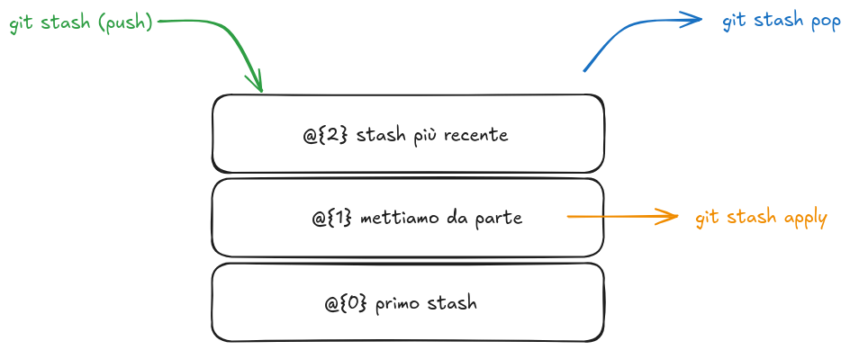
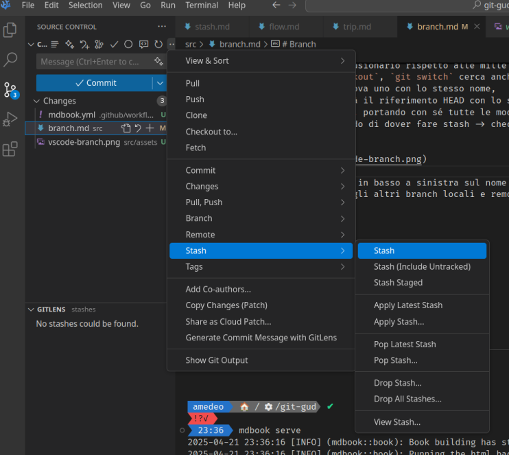
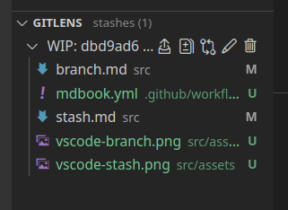

# Stash

Ti accorgi che il tuo lavoro di due ore ti ha portato ad un vicolo cieco?
Non buttare via tutte le modifiche dall'ultimo commit! Mettile in stash!

```bash
git stash
```
(aggiungi -u in fondo se vuoi includere nello stash anche file mai committati prima).



Il comando salva tutte le modifiche dall'ultimo commit in una memoria accessibile come uno stack.
Tuttavia, è sempre possibile visualizzare e applicare le modifiche anche non in cima
e anche in maniera non distruttiva.

Semplicemente, `git stash pop` rimuove e applica le modifiche in stash più recenti.
`git stash apply` le applica senza rimuoverle dallo stash.



Dal menu GitLens, è possibile visualizzare l'intero stack di stash, incluse le singole modifiche

