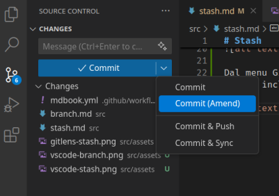
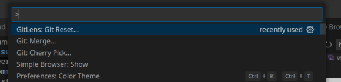
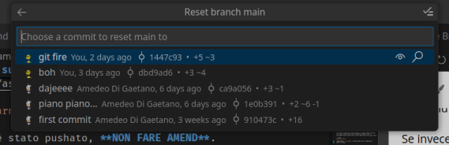
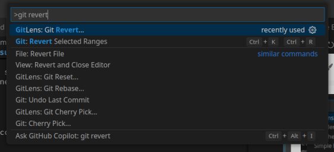
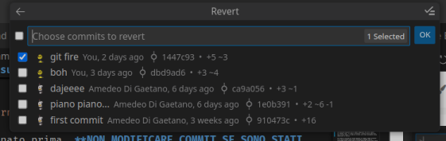
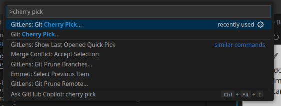
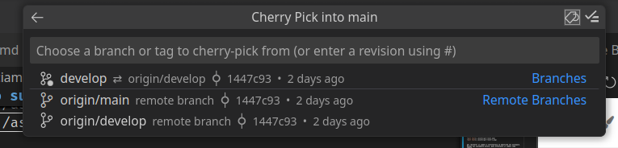
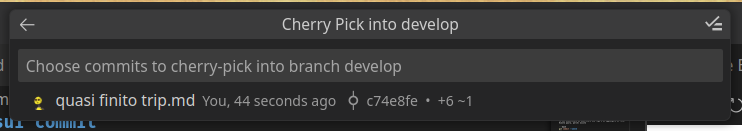

# Inciampando sui commit

Stai per pushare un commit per una fix, ma appena prima di cliccare ti accorgi che
ti sei dimenticato di modificare una riga o di aggiungere un file? Niente paura, perché esiste

```bash
git commit --amend
```

che permette di modificare l'ultimo commit in locale aggiungendo le ultime modifiche in stage.



<div class="warning">

Se il commit è stato pushato, **NON FARE AMEND**.
Come regola generale, una volta che un commit è online non va più toccato.

</div>

Se invece ti accorgi di aver fatto un commit che non volevi? Semplice:

```
git reset HEAD~1
```





per "disfare" il commit e reinstaurare le modifiche nel workspace.
Quando sei nuovamente pronto, puoi effettuare il commit come sempre.

<div class="warning">

Come già accennato prima, **NON MODIFICARE COMMIT SE SONO STATI PUSHATI**

</div>

Capisco che ormai ti sarai rotto di questi avvisi. Come fare per evitare problemi su commit già pushati? Se vuoi annullare le modifiche effettuate in un certo commit, il comando giusto è:

```bash
git revert
```




La soluzione migliore ad un commit sbagliato? Un altro commit!
Il comando creerà un commit contenente l'opposto delle modifiche dell'ultimo commit, in modo di tornare allo stato precedente senza modificare la storia.

Se invece ti accorgi di volere davvero un singolo commit presente su un altro branch senza voler effettuare un merge (che si porterebbe dietro anche tutte le altre modifiche) allora puoi usare

```bash
git cherry-pick
```
(aggiungendo `--no-commit` verranno prese solo le modifiche e messe in stage)





