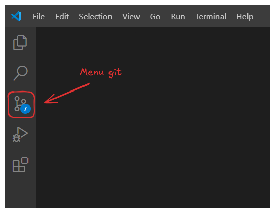
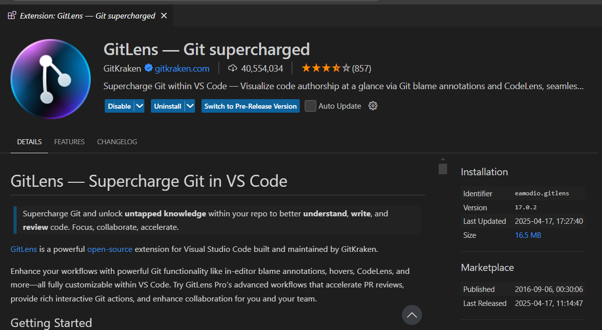
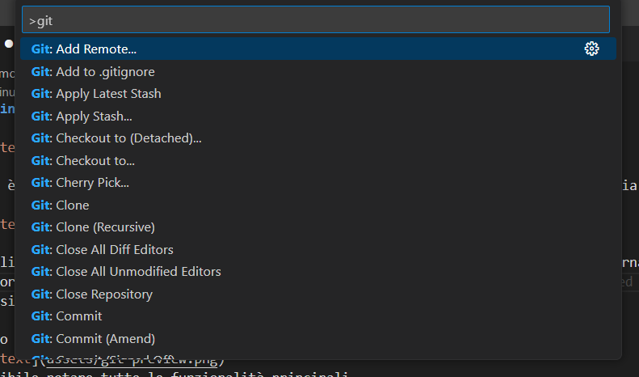

# Git in VSCode

Da qui è possibile accedere a tutte le funzionalità di Git che VSCode fornisce, tuttavia...

Consiglio _vivamente_ di installare l'estensione GitLens, che fornisce interfacce alternative e
ulteriori comandi git senza toccare il terminale!
La versione gratuita va benissimo per la maggior parte delle persone.

Aprendo il menu:

è possibile notare tutte le funzionalità principali.

Tutte le rimanenti si trovano sulla paletta dei comandi, che si apre con `Ctrl + Shift + P`

Inoltre, con una licenza GitHub Copilot adeguata, è possibile:
- Generare un messaggio di commit in base alle modifiche effettuate (sempre meglio del generico "Fix")
- Effettuare una vera e propria code review, per ulteriori dettagli guarda [qui](https://docs.github.com/en/copilot/using-github-copilot/code-review/using-copilot-code-review?tool=vscode)