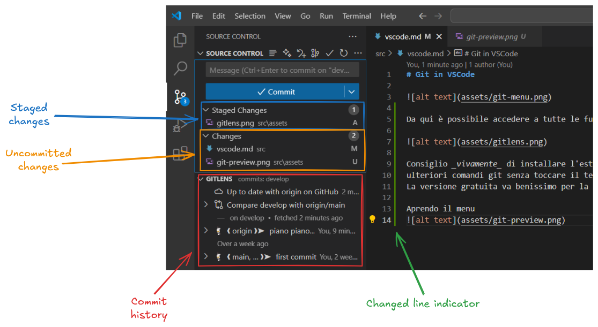

# Git in VSCode

Da qui è possibile accedere a tutte le funzionalità di Git che VSCode fornisce, tuttavia...

Consiglio _vivamente_ di installare l'estensione GitLens, che fornisce interfacce alternative e
ulteriori comandi git senza toccare il terminale!
La versione gratuita va benissimo per la maggior parte delle persone.

Aprendo il menu:

è possibile notare tutte le funzionalità principali.

Tutte le rimanenti si trovano sulla paletta dei comandi, che si apre con `Ctrl + shift + P`
